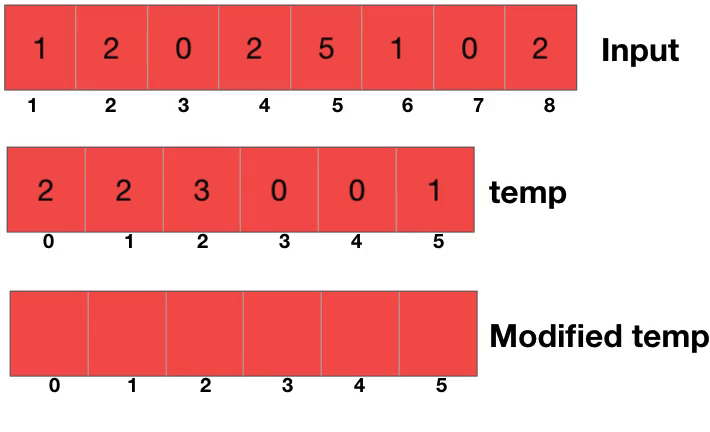

# Counting Sort
## Idea
Vengono utilizzati 3 vettori:
- A: Vettore contenente gli elementi non ordinati
- B: Vettore di output che contiene gli elementi di A ordinati
- C: Vettore ausiliario che contiene le occorrenze degli elementi di A (C[j] contiene il numero di volte in cui il numero j appare in A)

### Come utilizzo C
- Inizializzo C di dimensione k+1 con tutti elementi a 0
- Scansiono A e incremento i valori in C (Stabile)

### Come ottengo B
- Modifico C in modo che C[j] contenga il valore corrispondente a quanti elementi < o = a j si trovano in A
- Scandisco a da DX verso SX inserendo A[i] in posizione C[A[i]] nel vettore B
- Decremento C[A[i]]

## È Stabile
## Non è In-Place

